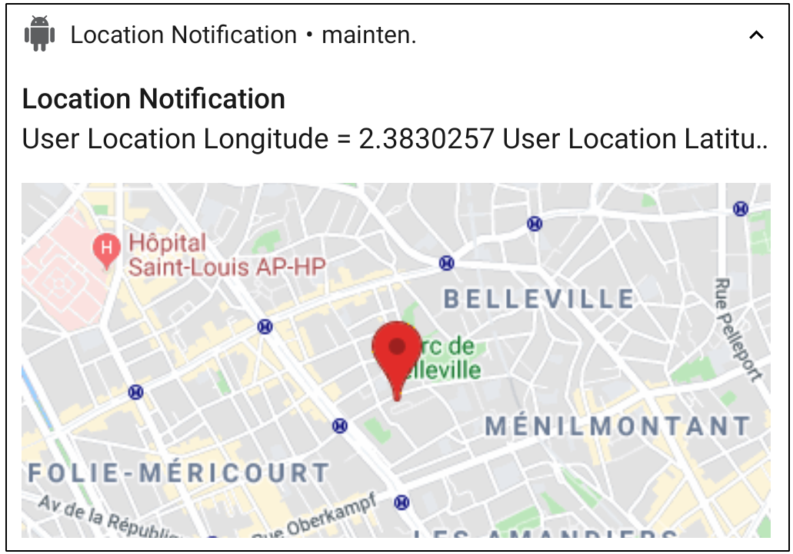
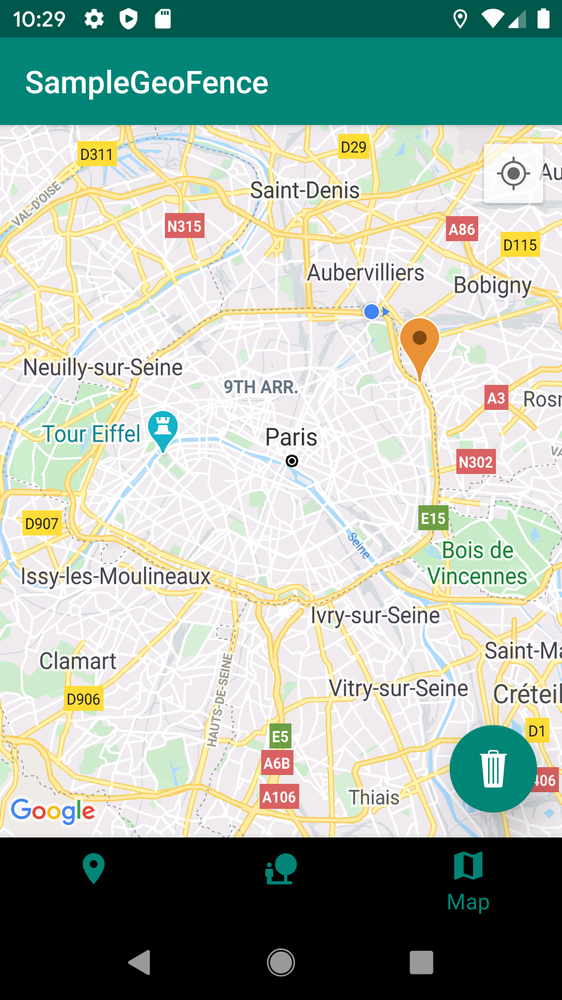
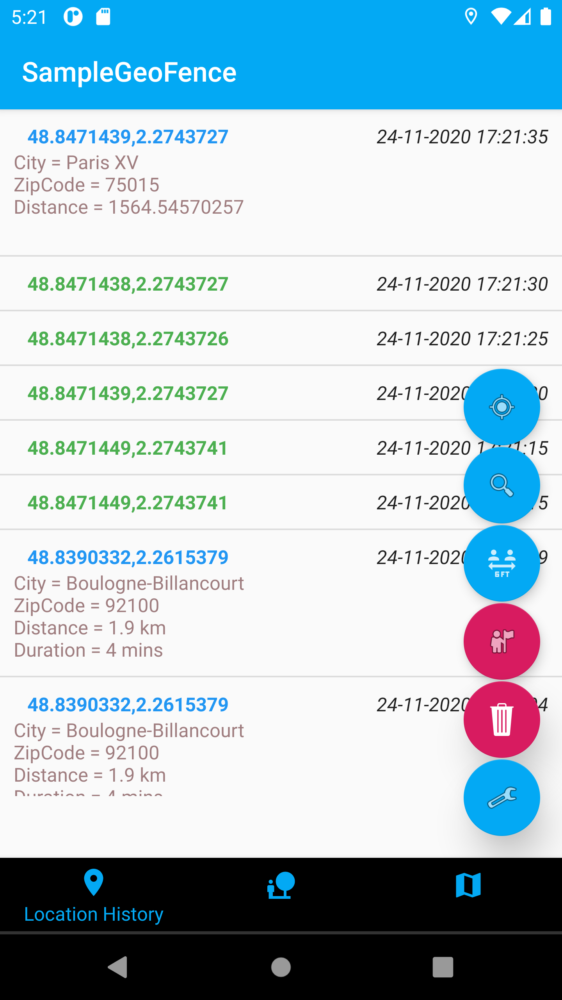
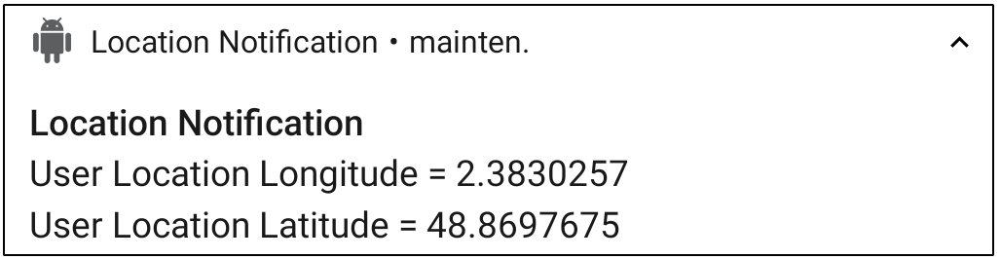
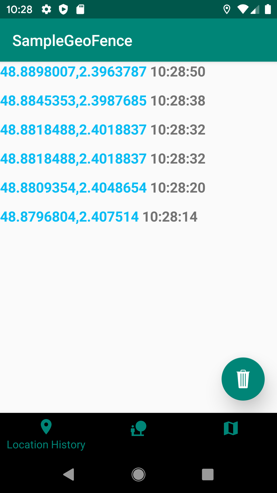

## Woosmap Geofencing

Location intelligence is one of the next revolutions to improve and "smoothen" user experience on mobile. 
Mobile operating systems use and provide multiple location services that might be tricky to handle or tune to achieve advanced location based services on mobile. And users are more and more aware of the capabilities of their mobile devices.
During the last two years, we analysed, exploited and followed the evolution of those location services, changes that occurred either on tech side or regulation side.

We are convinced that location is an effective way for App makers to propose tailor made and locally contextualised interactions with mobile users.
But knowing the location of a user is not enough. Knowing from what a user is close to or what he is visiting is the important part. So we decided to share our findings and tricks for location collection on mobile to help you focus on this real value of location. 

This repository is designed to share samples of codes and a SDK on Android to take the best of location in your mobile apps. 
We had 3 main focus when developing and sharing this code: take full advantage of location capabilities of mobile devices, doing so in a battery friendly way and be fair with user privacy (see [Location permissions](./doc/CheckLocationpermissions.md)). 

Woosmap Geofencing SDK and sample app should help you build Rich Push Notifications (highlighted with a Location context), analyse your mobile users surroundings (search for proximity to your assets, competitors, etc) and much more on Android to go a step further on Location Intelligence.

### Use case where location matters:

As a banking company, you need to enrich the expense list with local information (logo, shop info, etc)? Use this repo to learn how to leverage locally enriched notification to retrieve local information where your users spend their money.

As a retailer company, you need to be informed when a user is close to one of your stores (or competitors’)? Find in this repo how to collect in background location of your users and build your own geofencing analysis.

As a retailer, insurance, banking or travel company, you need to add local context to your user profiles in your CRM? Build your own process of background location collection in your mobile app and analyze geographic behaviors of your mobile users.

As a retailer, insurance, banking or travel company, you want to be informed when a user is visiting specific POIs you decided to monitor (your own stores, your competitors, specific locations)? Use our SDK/code samples to not just collect location but directly obtain "visit triggers" and build advanced scenarios (e.g. a Bank being able to propose specific loans or services when users visits Real Estate agencies, Car Dealers, etc - an Insurance company proposing travel insurance when users visit airports, car insurance when users visit car dealers, etc)

## Contributing

Pull requests are welcome. For major changes, please open an issue first to discuss what you would like to change.
Thank you for your suggestions!

## License
Woosmap Geofencing is released under the MIT License. See LICENSE file for details.

##  Overview

### Get user location 

Collect in background user's locations and host them in a local database. Call the Woosmap Search API to retrieve closest stores to each location to locally contextualized users journeys.

<p align="center">
  
</p>

### Enrich Notification with user location and POIs (Points of Interest)
Get the location of a user on notification reception, to complete the payload with local information from third parties APIs.  
In this sample, fetched location is then used to perform a request to the Woosmap Search API to get the closest POIs (Points of Interest) to the location of the user. In addition, a call to Google Static Map is performed to enrich the notification with a map displaying the user's location and the closest POIs.

<p align="center">
  
</p>

### Detect Visits (spending time at one place) of your users 
Get the location and the time spent when a user is visiting places. Once again use the Woosmap Search API if needed to detect if your users visit you stores, your competitors or POI you may want to monitor. 

<p align="center">
  
</p>

### Detect Zone of Interest (cluster) of your users
An area of interest such as a geographic location in which the user has spent some time from visits.
<p align="center">
  
</p>

##  Pre-requisites
-   Android SDK 26+ (tested witht he simulator and real devices)
Disclaimer: the code should be comatible with Android 6 but it was not tested.
-   Android Build Tools
-   Android Support Repository
-   Firebase Credentials
-	OjAlgo dependency [https://www.ojalgo.org/](https://www.ojalgo.org/)

### Installation
* This sample uses the Gradle build system. To build this project, use the "gradlew build" command or use "Import Project" in Android Studio.
* Get config file for your Android app
* Compile and install the mobile app onto your mobile device.
* Download Firebase config file:
	1.  Sign in to Firebase, then open your project.
	2.  Click , then select  **Project settings**.
	3.  In the  **Your apps**  card, select the package name of the app for which you need a config file.
	4.  Click   **google-services.json**, then add it to your app.
 * If you don't config Firebase and don't add the file **google-services.json** to compile the project. So remove the below line from your app-level build.gradle in the app who triggered parsing.
```java
apply plugin: 'com.google.gms.google-services'
```

### Get Keys
* Get the token in the log debug.
* If you want a map in the notification and a map in your app, get Google Maps API Key for requesting a static map (see [Google documentation](https://developers.google.com/maps/documentation/maps-static/get-api-key))
<p align="center">
 	
</p>

<p align="center">
 	
</p>


* If you want to retrieve the closest store to the user's location, load your assets in a Woosmap Project and get a Woosmap Key API (see [Woosmap developer documentation](https://developers.woosmap.com/get-started).)
<p align="center">
	
</p>
<p align="center">
	
</p>

* If you don't use any third party API and don’t define API keys, the notification and the app will only display the location (lat/long) of the user.
<p align="center">
	
</p>

<p align="center">
	
</p>

## Usage 
The first step that should always be done each time your app is launched (in Foreground AND Background) is to set your Woosmap Private key Search API. This should be done as early as possible in your `mainActivity` on the method `onCreate`.

### Import and instanciate Woosmap library

Instanciate Woosmap and set keys: 
```java
@Override
protected void onCreate(Bundle savedInstanceState) {
    super.onCreate(savedInstanceState);
    setContentView(R.layout.activity_main);
	
	// Set Keys  
	WoosmapSettings.privateKeySearchAPI = "";  
	WoosmapSettings.privateKeyGMPStatic = "";

    // Instanciate woosmap object
    this.woosmap = Woosmap.getInstance().initializeWoosmap(this);
      
	
    this.woosmap.setLocationReadyListener(new WoosLocationReadyListener());
    this.woosmap.setSearchAPIReadyListener (new WoosSearchAPIReadyListener ());
    this.woosmap.setVisitReadyListener (new WoosVisitReadyListener ());

    // Visit Detection Enable
    this.woosmap.setVisitEnable (true);

    // For android version >= 8 you have to create a channel or use the woosmap's channel
    if (Build.VERSION.SDK_INT >= Build.VERSION_CODES.O) {
        this.woosmap.createWoosmapNotifChannel();
    }
}
@Override
public void onResume() {
    super.onResume();
    if (checkPermissions()) {
        Log.d("WoosmapGeofencing", "Permission OK");
        this.woosmap.onResume();
    } else {
        Log.d("WoosmapGeofencing", "Permission NOK");
        requestPermissions();
    }
}

@Override
public void onPause(){
    super.onPause();
    Log.d("WoosmapGeofencing", "BackGround");
    if (checkPermissions()) {
        this.woosmap.onPause();
    }
}
```

To get Google map in the app, add your GMP SDK android key in the manifest: 
```xml
<?xml version="1.0" encoding="utf-8"?>
<manifest xmlns:android="http://schemas.android.com/apk/res/android"
    package="com.webgeoservices.sample">

    <uses-permission android:name="android.permission.INTERNET" />
    ...
	...

    <application
      ...
      ...

    	<meta-data
            android:name="com.google.android.geo.API_KEY"
            android:value="GMP_KEY"/>

    </application>

</manifest>
```

To work properly, you have to instanciate the Woosmap object in the onCreate function and call Woosmap's onResume and onPause functions.

### Configure filters to refresh location and activate visits detection

You can make filters:
* Time to refresh user's location in seconds:
```java 
static public int currentLocationTimeFilter = 0;  
 ```
 * Distance to refresh user's location in meter:
```java 
static public int currentLocationDistanceFilter = 0;  
 ```
 * Time to request Search API in seconds:
```java 
static public int searchAPITimeFilter = 0;  
 ```  
 * Distance to request Search API  in meter: 
```java  
static public int searchAPIDistanceFilter = 0;  
 ``` 
 * Accuracy of the location in meters:
```java   
static public int accuracyFilter = 0;  
 ```
  * Distance detection threshold for visits:
```java   
static public double distanceDetectionThresholdVisits = 25.0;
 ```
 * Delay for outdated notification in seconds: 
```java   
static public int outOfTimeDelay = 300;
 ```
To apply filters,  set the filters in singleton `WoosmapSettings` like this:
```java   
WoosmapSettings.currentLocationTimeFilter = 30; 
```

The default parameters were determined by testing in real conditions in order to obtain the best data while consuming little battery, you can modify them according to your use cases.
### Retrieve User Location

In your `mainActivity`, create a Listener connect to the interface `Woosmap.LocationReadyListener` and set a callback to retrieve user current location.

```java
public class WoosLocationReadyListener implements Woosmap.LocationReadyListener
{
    public void LocationReadyCallback(Location location)
    {
        onLocationCallback(location);
    }
}

private void onLocationCallback(Location currentLocation) {
    ...
}
```

### Retrieve POIs from Search API

In your `mainActivity`, create a listener connected to the interface `Woosmap.SearchAPIReadyListener` and set a callback to retrieve POIs from the Search API request.
```java
public class WoosSearchAPIReadyListener implements Woosmap.SearchAPIReadyListener  
{  
    public void SearchAPIReadyCallback(POI poi)  
    {  
        onPOICallback(poi);  
  }  
}  
  
private void onPOICallback(POI poi) {  
    // get POI
}
```

### Retrieve visit detection 

In your `mainActivity`, create a listener connected to the interface `Woosmap.VisitReadyListener` and set a callback to retrieve visits.
```java
private void onPOICallback(POI poi) {  
    new POITask(getApplicationContext (),this).execute();  
}  
  
public class WoosVisitReadyListener implements Woosmap.VisitReadyListener  
{  
    public void VisitReadyCallback(Visit visit)  
    {  
        onVisitCallback(visit);  
  }  
}  
  
private void onVisitCallback(Visit visit) {  
    // get visit  
}
```

### Retrieve Zone of Interest
ZOIs are created from visits. These are clusters which represent the grouping of several visits which have been calculated thanks to the Fast Incremental Gaussian Mixture Model of classification Algorithm  [(FIGMM].(https://journals.plos.org/plosone/article?id=10.1371/journal.pone.0139931))

you can recover the ZOIs generated by making a request in the database.
```java
ZOI[] ZOIList = WoosmapDb.getInstance(mContext, true).getZOIsDAO().getAllZois();
```

Each ZOI includes the following informations:

 - The list of id visits included in this ZOI

```java
public ArrayList<String> idVisits = new ArrayList<>();
```

 - The latitude and longitude of the center of the ZOI

```java
public double lngMean;
```
```java
public double latMean;
```

 - Age is used to determine if an ZOI should be deleted by the algorithm

```java
public double age;
```

 - Represents the number of visits present in the ZOI

```java
public double accumulator;
```

 - The covariance determinant

```java
public double covariance_det;
```

 - Estimation of proability

```java
public double prior_probability;
```

 - The covariance of a cluster

```java
public double x00Covariance_matrix_inverse;
public double x01Covariance_matrix_inverse;
public double x10Covariance_matrix_inverse;
public double x11Covariance_matrix_inverse;
```

 - This is the [Well-known text representation of geometry](https://en.wikipedia.org/wiki/Well-known_text_representation_of_geometry) of the ZOI polygon

```java
public String wktPolygon;
```

 - The date of entry for the first ZOI visit

```java
public long startTime;
```

 - The release date of the last ZOI visit

```java
public long endTime;
```

 - The duration of all the accumulated visits the ZOI

```java
public long duration;
```

### Enable location after a device reboot
#### Create the BroadcasReceiver
To collect location after a device reboot without having to relaunch the application, you have to create a Broadcast which launches the jobInstantService `WoosmapRebootJobService` when it receives the BOOT_COMPLETED event.
```java
package com.webgeoservices.sample;  
  
import android.content.BroadcastReceiver;  
import android.content.Context;  
import android.content.Intent;  
  
import com.webgeoservices.woosmapGeofencing.WoosmapRebootJobService;  
  
public class RunOnStartup extends BroadcastReceiver {  
  
    public void onReceive(Context context, Intent intent) {  
        if ("android.intent.action.BOOT_COMPLETED".equals(intent.getAction())) {  
            WoosmapRebootJobService.enqueueWork(context, new Intent());  
  }  
    }  
}
```

#### Add the BroadcastReceiver to the Manifest
Add the permission `android.permission.RECEIVE_BOOT_COMPLETED`
```
<uses-permission android:name="android.permission.RECEIVE_BOOT_COMPLETED" />
```
Then, just declare your receiver in the Manifest.xml in the application bloc

```
<receiver android:name=".RunOnStartup">
    <intent-filter>
        <action android:name="android.intent.action.BOOT_COMPLETED"/>
        <category android:name="android.intent.category.DEFAULT" />
    </intent-filter>
</receiver>
```

## Simulate Notification
-   Get the notification token in the log debug or on the main screen of the demo app.
    
-   Install the app PushNotification from the github repo: [https://github.com/onmyway133/PushNotifications](https://github.com/onmyway133/PushNotifications). This desktop app will help you simulate notification sending if you do not have any other Notification Solutions.
    
-   Enter your server key: [https://github.com/onmyway133/PushNotifications#android-server-key](https://github.com/onmyway133/PushNotifications#android-server-key)
    
-   Enter a message in json format like this "{"location":"1","timestamp":"1589288354"}". The object "location" allows to have a location (lat/long) displayed in the notification. The "timestamp" object validates the delay between the server time and the mobile time to check if the retrieved location is not outdated (if difference between server and mobile time is greater than 300 sec, notification will not be displayed).
    
-   If you want to send notification directly from an Android app, you can use this project: [https://github.com/megamendhie/Notify](https://github.com/megamendhie/Notify). Change the code to enter the server key and the notification token of the app to target.


## Additional Documentation

* [Enabling Location](./doc/EnablingLocation.md): To use location, first enable associated services on the user device. Find out here how to do it and more importantly what are the different permissions and consequences of choices made by the users.

* [Set up a Firebase Cloud Messaging](./doc/EnablingLocation.md): Find out how to add Firebase Messaging to your App and regularly check if your notification token is up to date.

* [Handling messages](./doc/HandlingMessages.md): If you are here, it’s because you want custom notifications. Find out here how to handle those.

* [Check Location permissions](./doc/CheckLocationpermissions.md): Retrieve location from the OS location services to enrich your notification.

* [Check Timestamp of the payload](./doc/CheckTimeStamp.md): Because differences may occur between sending time and reception time, you may need to check it before retrieving a location.

* [APIs request](./doc/APIsrequest.md): Location of the mobile is one thing but knowing from what the mobile is close to is another thing. Find out here how to use Woosmap Search API to “geo contextualize” the location of your users.

* [Visit Algorithm](./doc/VisitAlgorithm.md): You will find a diagram explaining the algorithm of visits.

* [ZOI Algorithm](./doc/ZOIAlgorithm.md): You will find a diagram explaining the algorithm of ZOI.
